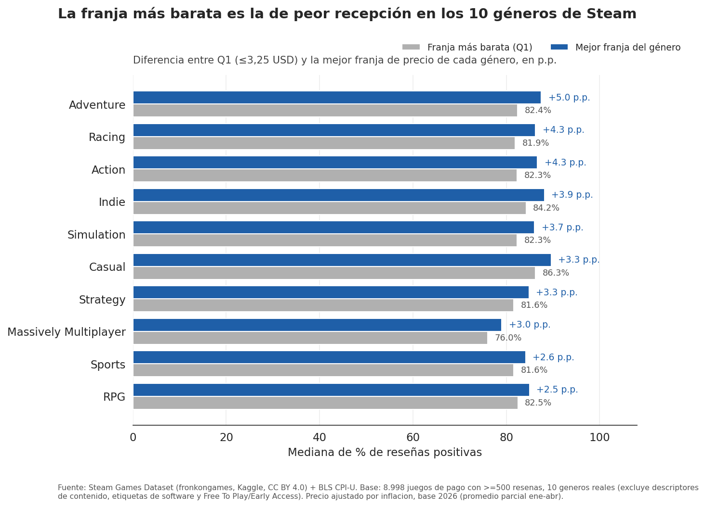
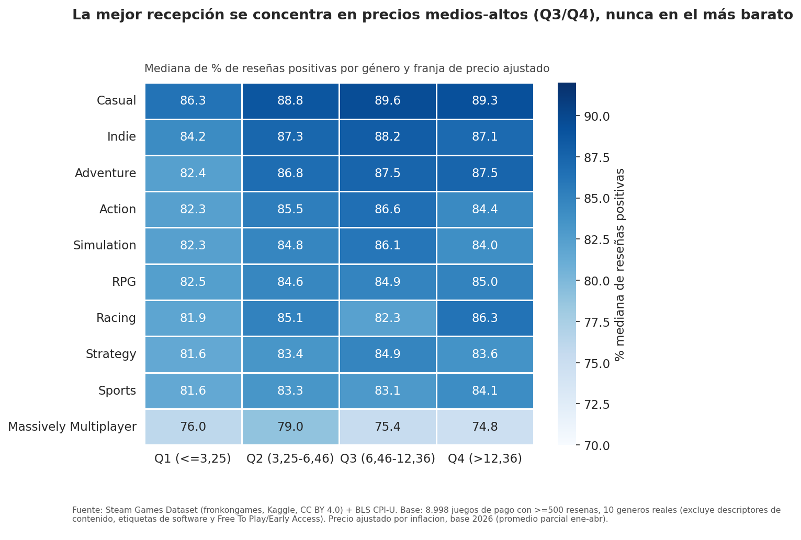
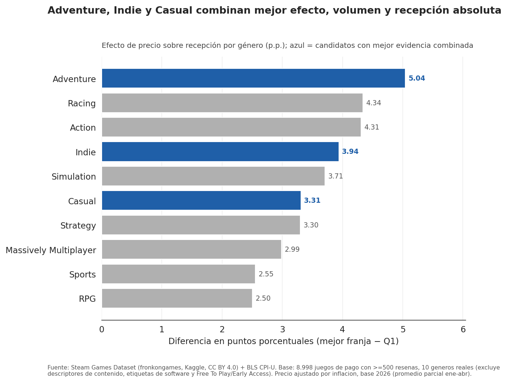
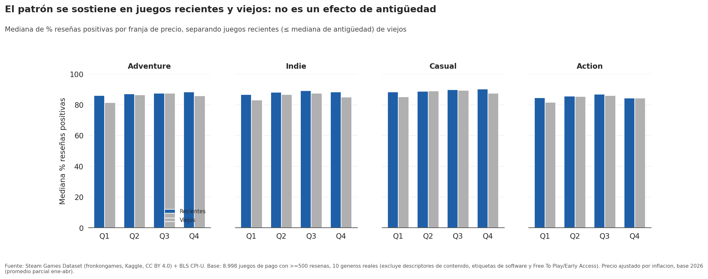

% Precio y recepción en Steam: ¿dónde priorizar due diligence de inversión?
% Resumen ejecutivo — Caso de estudio de portafolio
% 28 de julio de 2026

## Contexto

Un fondo de inversión evalúa entrar al sector de videojuegos y necesita un criterio, basado en
datos, para decidir en qué **género** priorizar su análisis de inversión (due diligence). Este
informe usa el catálogo histórico de Steam —el mayor mercado de videojuegos de PC— como muestra de
referencia del mercado.

**Pregunta que respondemos:** ¿qué combinaciones de género y precio logran mejor recepción de los
jugadores (medida en % de reseñas positivas), y qué géneros son por tanto mejores candidatos de
inversión?

## Qué hicimos

Analizamos 117.430 juegos publicados en Steam. Para aislar una señal confiable, nos concentramos en
los 8.998 juegos de pago con al menos 500 reseñas —el volumen mínimo para que el % de reseñas
positivas sea estadísticamente confiable— y los agrupamos en 10 géneros reales de videojuego y 4
franjas de precio (de la más barata a la más cara, calculadas sobre los datos mismos). Los precios
se ajustaron por inflación para poder comparar juegos de distintos años en igualdad de
condiciones.

## Hallazgo principal

**La franja de precio más barata es, en los 10 géneros sin excepción, la que peor recepción
recibe.** La mejor recepción no está en el precio más alto posible, sino en un rango medio-alto
(aproximadamente entre 6 y 12 dólares ajustados, según el género).

La diferencia es real pero moderada: entre 2,5 y 5 puntos porcentuales de mejora al pasar de la
franja más barata a la mejor franja de cada género. No es un efecto dramático, pero sí consistente
en las 10 categorías.

## Candidatos con mejor evidencia para due diligence

De los 10 géneros, tres combinan el mejor efecto de precio, el mayor volumen de evidencia y la
recepción absoluta más alta: **Adventure, Indie y Casual.**

- **Adventure** muestra el mayor salto de recepción entre la franja más barata y la mejor franja
  (+5 puntos porcentuales), con 4.030 juegos de evidencia.
- **Indie** es el género con más volumen de evidencia (5.561 juegos) y una mejora sólida (+3,9
  puntos).
- **Casual** tiene la recepción absoluta más alta de los 10 géneros en su mejor franja de precio
  (89,6% de reseñas positivas), aunque con menor volumen (2.230 juegos).

**Massively Multiplayer** queda fuera de esta lista: es el género con peor recepción en todas las
franjas de precio y con muy poca evidencia (176 juegos) — no hay datos suficientes para
recomendarlo ni para descartarlo con confianza.

## ¿Es esto un efecto de que los juegos baratos son simplemente más viejos?

No. Repetimos el análisis separando juegos recientes de juegos más antiguos, y el patrón se
mantiene igual en ambos grupos: la franja más barata sigue siendo la de peor recepción,
independientemente de la edad del juego.

## Qué no responde este análisis

- **No prueba causalidad.** El patrón muestra una asociación entre precio y recepción, no que
  subir el precio de un juego mejore automáticamente sus reseñas. Puede reflejar que los estudios
  que cobran más también invierten más en calidad de producción.
- **No cubre la "cola larga.**" Excluimos deliberadamente los juegos con menos de 500 reseñas
  (34% del catálogo no tiene ninguna reseña) para mantener la confiabilidad estadística. Esa cola
  queda como análisis adicional pendiente.
- **No mide reseñas a lo largo del tiempo,** solo el acumulado histórico de cada juego a la fecha
  de recolección de los datos.
- Este análisis prioriza géneros; **no asigna presupuesto de inversión** ni reemplaza el due
  diligence específico de cada estudio o publisher.

## Próximo paso

La fase de recomendaciones formales (fase 6 del caso) traducirá esta evidencia en una propuesta
concreta de priorización, con sus limitaciones y los datos adicionales recomendados antes de
comprometer capital.

---

*Fuente: Steam Games Dataset (fronkongames, Kaggle, licencia CC BY 4.0) e índice de precios al
consumidor CPI-U (Bureau of Labor Statistics, EE. UU.). Caso de estudio de portafolio elaborado con
Python/pandas; metodología y verificaciones completas disponibles en el notebook técnico
`notebooks/caso_steam_precio_recepcion.ipynb`.*
